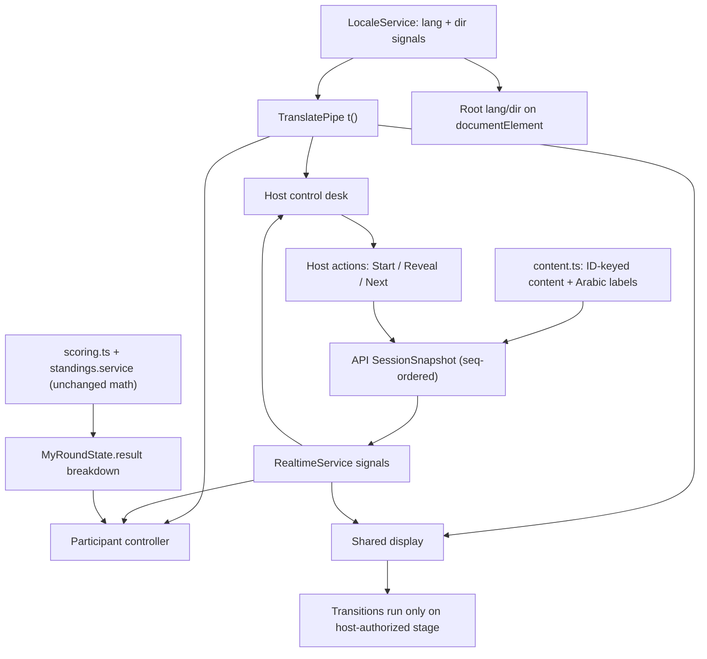

# ASAS Challenge UX Redesign with Full Arabic/English Support

## Overview
The app already has a working, server-authoritative event engine (NestJS + Socket.IO `seq`-ordered snapshots, Angular 19 standalone components using signals). The gaps are presentational, informational, and linguistic — not architectural:

- **No localization layer exists.** A workspace search for `lang|locale|i18n|dir=|rtl` under `apps/web/src` returns zero matches. Every string is hard-coded English in component templates and in `packages/shared/src/content.ts` (`GAME_TITLES`, `HOW_TO_PLAY`, ORDER `prompt`/`direction`/option labels, `CountryContent.name`).
- **Host dashboard has flat hierarchy.** `host.component.ts` renders Stage control, Race signals, Session, Rehearsal and a wide device roster table as sibling `.card`s of equal weight, and paints every `available()` entry of `ACTIONS` as one undifferentiated button row, so the next action is not identifiable. Signal controls render regardless of `gameType`, including during GEO and ORDER.
- **Paused is not the dominant instruction.** In `play.component.ts` pause is a small `alert-info` while `app-hold-button` still receives `[color]="signal()"`, so "GREEN — GO" keeps visual dominance. The display repeats the problem (`.signal.huge` plus a small paused badge).
- **Participant results are a bare number.** `MyRoundState.result` is only `{ raw: number; label: string }`, and the `GameResults` view shows tournament total and rank with no round score, game score, outcome explanation, or "what happens next".
- **Display is document-style.** Dark cards plus `app-standings-table [pageSize]="12"`, a fixed three-slot podium built from a top-three-ties computation that collapses large ties into arbitrary places, page-level vertical scrolling, and permanently visible mute/volume chrome.

This plan preserves the engine, the scoring math in `packages/shared/src/scoring.ts`, host authority, and recovery rules. It adds a bilingual layer, one additive breakdown field on the personal round state, and rebuilds the three role surfaces on shared tokens and components. All new TypeScript uses `const`/`let`, never `var`, and stays on the approved NestJS + Angular stack [tech-stack].

## Design

### 1. Localization architecture (new `apps/web/src/app/i18n/`)
- `locale.service.ts` — root-provided service holding `lang = signal<'en' | 'ar'>()`, `dir = computed(() => lang() === 'ar' ? 'rtl' : 'ltr')`, and `t(key, params?)`. The preference is persisted per role (`asas.lang.participant`, `asas.lang.host`, `asas.lang.display`) through the existing `core/storage.ts` helpers, so the host, the shared display, and each phone are independent. A participant switching language must never switch the room.
- `strings.en.ts` / `strings.ar.ts` — one flat typed dictionary each; `StringKey` is derived from the English file so a missing Arabic key is a compile-time error. Arabic copy follows the supplied terminology (امش… وقف!، وين الدولة؟، رتّبها!، ابدأ الجولة، اعرض النتائج، استئناف، بانتظار المقدّم، اضغط باستمرار للمشي، خرجت من هذه الجولة، ثبّت موقعي، ثبّت ترتيبي، نقاط الجولة، نقاط اللعبة، مجموع البطولة).
- `t.pipe.ts` — signal-backed `TranslatePipe` so templates read `{{ 'play.locked' | t }}` and a language switch re-renders without a reload or a new identity.
- Root wiring in `app.component.ts` sets `document.documentElement.lang` and `dir` from the active role locale. Layout moves to logical CSS properties (`margin-inline-start`, `padding-inline`, `inset-inline-start`) instead of `left`/`right`.
- **Game geometry stays physically LTR.** The race lane (`[style.left.%]` on the runner), the globe and its coordinates, and the top-to-bottom ORDER sequence get `direction: ltr` pinned on their containers, so Arabic localizes the surrounding UI without mirroring game meaning.
- **Content stays ID-keyed.** `packages/shared/src/content.ts` gains `nameAr` on `CountryContent`, `promptAr`/`directionAr`/Arabic option labels on `OrderContent`, and `GAME_TITLES_AR`. `RoundPublic` carries the parallel Arabic label fields. Option `id`, `code`/`countryCode`, `questionId`, and `correctOrder` remain the only score-bearing identity and are never translated [secure-coding].
- **Numerals and bidi.** One convention: Western Arabic digits (0-9) everywhere with `tabular-nums`. Names, join codes, timestamps, fractions, units, and score fractions are wrapped in `<bdi>` / `unicode-bidi: isolate` so mixed-script text cannot scramble.

### 2. Host — a focused live-event control desk
Rebuild `host.component.ts` into a three-zone shell that fits 1366x768 without page scroll:
- **Status bar:** title, join code, effective-state chip, game and round `X/Y`, remaining round time and elapsed event time as two clearly distinct readouts, host socket status separate from the participant online count.
- **Progression strip:** Lobby → Instructions → Practice → Game → Results, plus a compact three-dot marker for overall game progress (not a wall of badges).
- **Live area:** stage information, a compact audience preview, and the single next action.

New components:
- `host/primary-action.component.ts` — one stable primary-action slot whose label and availability derive from the authoritative effective state (Start Practice / Start Round / Resume / Reveal Results / Next Round / Next Game / Show Final Results). Remaining `ACTIONS` move to a secondary "More stage actions" row, keeping "prepare the next round" and "start it" distinct as the existing rules require.
- `host/audience-preview.component.ts` — a small, non-interactive render of what the room currently sees, placed beside the signal panel.
- `host/signal-panel.component.ts` — rendered only when `snap()?.gameType === 'RLGL'`. Manual/Auto becomes a segmented mode selector with the informational line "Signals run automatically. You still control the event." styled as `alert-info`, never as an error banner. `.alert-error` is reserved for real failures, and `err()` is cleared in the snapshot `effect` whenever `state`/`seq` changes so feedback cannot go stale.
- `host/drawer.component.ts` — exports, void/close-session, session links, recovery tools, and the roster move into drawers/tabs.
- `host/roster-list.component.ts` — replaces the wide table with rows (`#`, avatar + name, connection, ready) and reveals `deviceType`/`model`/`os`/`browser` in an expandable participant detail; collapses to cards on mobile.
- `host/rehearsal-panel.component.ts` — simulated-player tools in a visually separated rehearsal drawer, out of the live workspace.

Empty and irrelevant states: "No players yet. Share the join code to get started."; Ready and Answers counters render only in stages where they mean something (ready during Instructions/Practice, answers during RoundActive/InputLocked). End Session and void/reset stay away from progression actions with their existing confirmations and explicit consequences.

### 3. Participant — a simple personal game controller
- Join with name only; device detection stays in the background; the avatar is auto-assigned and customization never blocks entry.
- Compact header: avatar + name, language toggle (EN / ع), accessible help. Points and rank appear once, not in every corner.
- `shared/waiting-card.component.ts` — names the current stage, says what the host is preparing, and previews the next action without leaking answers.
- `shared/result-breakdown.component.ts` — renders the required hierarchy: outcome sentence ("Inside the country!" / "2 cards in the correct positions") → This round → This game → Tournament total and rank → "Waiting for the host to start the next round."
- **Additive API data (not guessed values):** extend `MyRoundState.result` to `{ raw, label, roundPoints, roundMax, gamePoints, gameMax, tournamentTotal, tournamentRank }`, populated in the API from the existing `round-scoring.ts` and `standings.service.ts` outputs. No new scoring math, no client-side invention.
- Pause becomes dominant: a full-width PAUSED panel with explanatory text, `app-hold-button` disabled, and the previous signal shown only as secondary context.
- Layout uses `dvh`, `env(safe-area-inset-*)`, and keeps the primary action reachable with the on-screen keyboard open; result cards are sized intentionally rather than stretched.

### 4. Shared display — a presentation for the whole room
- Fixed-viewport 16:9 composition (`height: 100dvh; overflow: hidden`), one dominant visual per stage (arena, globe, cards, results), large title and timer, no document-style scrolling in the normal flow.
- Audio/fullscreen controls move into a discreet setup overlay behind the existing `audio.ready()` gate; hidden during presentation, reachable when needed.
- `display/leader-summary.component.ts` replaces the table-first standings with a leader summary plus a readable supporting list, ~8-10 rows per page, row count adapted to available height rather than clipping or shrinking text. Paging and ceremony steps are driven by the host dashboard through the existing `CEREMONY_STEP` payload plus a `standingsPage` field on the snapshot, kept `seq`-ordered so it cannot race the stage machine.
- `display/tied-leaders.component.ts` replaces the fixed three-slot podium; ranks come from the real `rank` values in `StandingRow`, so ten tied leaders render as a shared tied-leaders band instead of an arbitrary podium, until the tie rules resolve it.
- Current-game standings are visually distinct from tournament standings, with recognizable game labels/icons rather than Race / Globe / Order shorthand alone. A not-yet-played game shows "—" / "Not played" while still contributing its real 0 to `total`; a played round scoring zero shows `0`.
- RLGL arena readability: short `#number` identifiers, a few featured names, alive/finished/eliminated counts, and a capped event feed. The runner avatar is clamped inside the lane with `calc()` insets so it is never clipped at 0% or 100%.
- Transitions (round intro, countdown, action, reveal, score movement, standings) run only after the host authorizes the corresponding stage; animation completion never starts a round. Results stay on screen long enough to read. Long names, many tied winners, and large scores are constrained so nothing leaves the frame.

### 5. Games
- **Red Light, Green Light:** unmistakable effective state on host, phone, and display for GREEN, RED, PAUSED, ELIMINATED (death animation, controlled sound, "0 points this race", returns next race), FINISHED, and DISCONNECTED (freeze safely, reconnect, restore the real life state without reviving). Large one-handed hold control; localization, resize, or opening a menu must never leave a stuck hold or emit an unintended move command. Server-authoritative timing, shared red tolerance, one-time death events, and host-triggered respawn are preserved.
- **Pin the Country:** a short rotate/zoom/tap/lock demonstration; country name and timer stay readable; explicit pin status (not placed / saved / locked); placing a pin distinct from rotating; Reset View available without crowding the primary action; adequate globe space in portrait and landscape; controls never cover the likely target or the pin. Reveal shows the correct country, the player's pin, distance when outside, and the earned score, with clustered pins on the big screen. Equal full points inside the country area and the existing distance formula outside are unchanged.
- **Order It!:** explicit requested order and which end is first; four spacious cards with a drag handle, position marker, and keyboard/touch alternatives; visible insertion position and subtle drop feedback; Lock My Order reachable without covering the last card. Reveal compares the submitted arrangement to the correct order and explains the score by correct positions; values and correctness stay hidden until the host reveals.
- **All three instruction screens:** one short sentence, three visual steps, a tiny demonstration, and clear readiness feedback. Instructions remain until the host advances; readiness never triggers play.

### 6. Tokens and Elm identity
Extend `styles.css` — which already holds the verified `colors.pdf` values (Navy `#051D49`, Blue `#0071CE`, Royal Blue `#0032A0`, Purple `#763CBC`, Deep Purple `#5A2C83`, Cyan `#00A1E0`, Peach `#FFA168`, Orange `#FF5D36`, Lavender `#CC8BDB`, Burgundy `#A12B2A`, neutrals `#F7F8FC`, `#E5E9F6`, `#BDC9E9`, `#2B2E65`, `#464D7E`) and the documented functional extension `--game-go: #15803D` — with a typography scale, spacing scale, elevation, focus rings, and an Arabic/Latin font stack. No new brand colors are invented, RED/GREEN semantics are unchanged, and "Built using ASAS" remains secondary attribution.

## Changes
- **New:** `apps/web/src/app/i18n/locale.service.ts`, `strings.en.ts`, `strings.ar.ts`, `t.pipe.ts`.
- `apps/web/src/app/core/storage.ts` — per-role language preference helpers.
- `apps/web/src/app/app.component.ts` — apply `lang`/`dir` at the root.
- `apps/web/src/styles.css` — typography/spacing/elevation/focus tokens, logical properties, RTL rules, bidi isolation, Arabic font stack.
- `apps/web/src/app/host/host.component.ts` + new `primary-action`, `signal-panel`, `audience-preview`, `drawer`, `roster-list`, `rehearsal-panel` components.
- `apps/web/src/app/participant/play.component.ts`, `join.component.ts` + new `shared/waiting-card`, `shared/result-breakdown`, `shared/stage-chip`.
- `apps/web/src/app/display/display.component.ts` + new `display/leader-summary`, `display/tied-leaders`, `display/setup-overlay`.
- `apps/web/src/app/games/hold-button.component.ts`, `globe.component.ts`, `order-cards.component.ts` — effective-state dominance, clamped runner, pin status, insertion feedback, keyboard alternatives, LTR-pinned geometry.
- `apps/web/src/app/shared/how-to-play.component.ts`, `standings-table.component.ts`, `timer.component.ts` — localized, tie-aware, presentation-sized.
- `packages/shared/src/types.ts` — Arabic label fields on `RoundPublic`, extended optional `MyRoundState.result` breakdown.
- `packages/shared/src/content.ts` — `nameAr`, `promptAr`, `directionAr`, Arabic option labels, `GAME_TITLES_AR`, Arabic `HOW_TO_PLAY`.
- `apps/api/src/rounds/snapshot.ts`, `round-scoring.ts`, `participation.service.ts`, `standings.service.ts` — emit Arabic labels and the result breakdown; solutions stay stripped before reveal [secure-coding].
- `apps/api/src/rounds/rounds.controller.ts` and the CSV export path — stable machine-readable IDs in exports with localized labels only in display columns; existing `/v1` REST shapes and host-key guard unchanged [api-conventions].

## To-dos
- [x] Write a concise, screenshot-grounded diagnosis and define the three role-specific journeys.
- [x] Add `LocaleService`, `TranslatePipe`, and typed `en`/`ar` dictionaries with per-role persistence.
- [x] Apply `lang`/`dir` at the root and convert `styles.css` to logical properties with RTL rules and bidi isolation.
- [x] Extend design tokens: typography scale, spacing, elevation, focus, Arabic/Latin font stack.
- [x] Add Arabic label fields to `content.ts` and `RoundPublic`, keeping IDs and correct answers language-independent.
- [x] Extend `MyRoundState.result` with the round/game/tournament breakdown and populate it from existing scoring and standings services.
- [x] Rebuild the host shell: status bar, progression strip, stable primary action slot, audience preview.
- [x] Move exports, session admin, roster details, and rehearsal tools into drawers; convert the device table into a list with expandable details.
- [x] Make the signal panel RLGL-only with a Manual/Auto segmented selector, informational (non-error) Auto text, and stale-feedback clearing on state change.
- [x] Rebuild the participant journey: compact header, purposeful waiting card, locked confirmation, full result breakdown.
- [x] Make PAUSED the dominant instruction on phone, host, and display, with the previous signal as secondary context only.
- [x] Compose the fixed-viewport display layout with a discreet setup overlay and host-controlled leaderboard paging.
- [x] Replace the table-first standings with a leader summary plus 8-10 readable rows and an explicit tied-leaders treatment.
- [x] Show unplayed games as "Not played" while preserving their real zero contribution to the total.
- [x] Improve RLGL arena readability (short IDs, featured names, alive/finished/eliminated counts, capped feed) and clamp the avatar inside the track.
- [x] Improve globe discoverability: rotate/zoom/tap demo, pin status, Reset View, adequate portrait/landscape space, controls clear of the target.
- [x] Improve Order It!: explicit direction, spacious cards, drag handle, insertion marker, keyboard/touch alternatives, reachable Lock.
- [x] Rework the three instruction screens: one sentence, three visual steps, tiny demo, readiness feedback that never triggers play.
- [ ] Verify both languages at 360/390/430 px, 768/1024, 1366x768, 1440x900, 1920x1080, 3840x2160, plus landscape and a short viewport.
- [ ] Verify language switching preserves session, stage, deadline, pin, card order, lock status, scores, and elimination state.
- [ ] Verify join through ceremony end-to-end across host, participant, and display, including Auto signal mode, refresh, and reconnection.
- [ ] Confirm no duplicate scoring, leaked answers, fabricated progress, or accidental revival is introduced.
- [ ] Capture before/after screenshots per role in both languages and write the handoff summary and genuine limitations list.

## Notes / Risks
- `colors.pdf` is not present in the workspace; the palette is taken from the verified values already documented in `styles.css`. Official Elm fonts and logo assets are also absent — a system Arabic/Latin stack will be used and no fallback will be presented as official.
- Extending `MyRoundState.result` touches the API/socket contract: ship the shared types, the API emitter, and the web consumer together, and keep the new fields optional so an older client cannot crash.
- Arabic copy needs a native review pass for Saudi-workplace tone; the supplied terminology table is a seed, not a complete dictionary.
- `SORT-07` (English alphabetical order) must keep the same letters in Arabic and say "English alphabetical order" explicitly in both languages. Any prompt that cannot be translated fairly is replaced for everyone before the event, never per locale mid-round.
- Host-controlled display paging adds a snapshot field — keep it `seq`-ordered so it cannot race the stage machine, and ensure no animation completion triggers a stage change.
- With 100 players, arena updates must be capped (limited feed, no full re-render per incoming message) and animations must respect `prefers-reduced-motion`, which `styles.css` already honors globally.
- Screenshot verification requires running the app; any device, viewport, or network condition that cannot be exercised locally will be reported as untested rather than assumed working.
