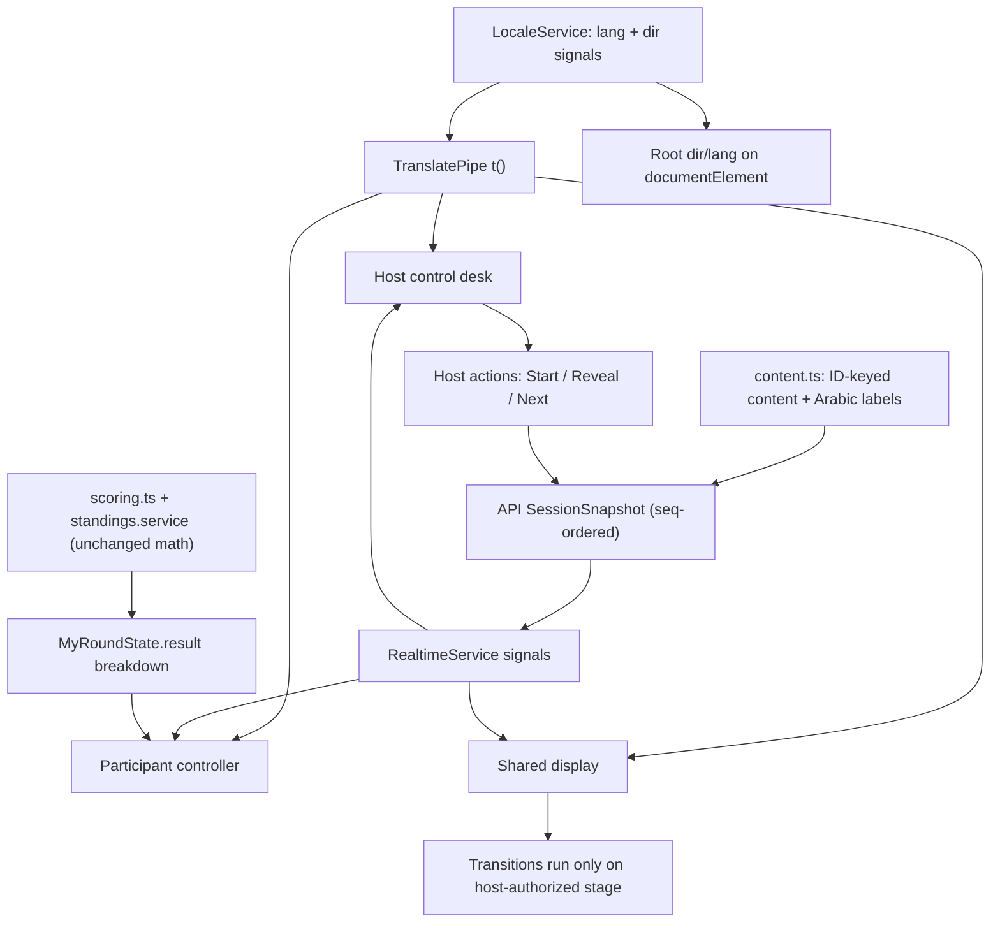

تم حفظ الخطة كمستند Markdown في مجلد الخطط. هذا ملخّصها النهائي كما هي مكتوبة:

# إعادة تصميم تجربة ASAS Challenge مع دعم عربي/إنجليزي كامل

## الخلاصة (Overview)
المحرّك الحالي سليم: NestJS + Socket.IO مع snapshots مرتّبة بـ `seq`، وواجهة Angular 19 standalone تعتمد signals. الفجوات عرضية ولغوية وإخبارية، لا معمارية:

- **لا توجد طبقة ترجمة إطلاقًا** — البحث عن `lang|locale|i18n|dir=|rtl` داخل `apps/web/src` رجع صفر نتائج. كل النصوص إنجليزية مكتوبة مباشرة في القوالب وفي `packages/shared/src/content.ts` (`GAME_TITLES`، `HOW_TO_PLAY`، نصوص Order وخياراتها، `CountryContent.name`).
- **لوحة المقدّم مسطّحة الأهمية** — في `host.component.ts` تظهر لوحات Stage / Race signals / Session / Rehearsal وجدول الأجهزة بـ 9 أعمدة كـ `.card` متساوية الوزن، وكل أزرار `available()` في صف واحد، فلا يتّضح الإجراء التالي. أزرار الإشارة تُرسم دائمًا حتى في جولات GEO و ORDER.
- **حالة الإيقاف غير مهيمنة** — في `play.component.ts` الإيقاف مجرّد `alert-info` بينما `app-hold-button` لا يزال يستقبل `[color]="signal()"`، فتبقى «GREEN — GO» هي الرسالة البصرية الأقوى. نفس المشكلة في شاشة العرض (`.signal.huge` مع شارة `⏸ Paused` صغيرة).
- **نتيجة المشارك رقم مجرّد** — `MyRoundState.result` هو `{ raw, label }` فقط، وشاشة `GameResults` تعرض المجموع والترتيب بدون نقاط الجولة أو نقاط اللعبة أو «ماذا بعد».
- **شاشة العرض بأسلوب مستند** — `card-dark` مع `app-standings-table [pageSize]="12"`، ومنصّة ثلاثية ثابتة `.p1/.p2/.p3` مبنية على `topThreeTies` تسحق التعادلات الكبيرة، مع تمرير رأسي وزر كتم ومنزلق صوت ظاهرين دائمًا.

الخطة تحافظ على المحرّك والاحتساب (`packages/shared/src/scoring.ts`) وسلطة المقدّم وقواعد الاستعادة، وتضيف طبقة ثنائية اللغة، وحقل تفصيل واحد في الحالة الشخصية، وتعيد بناء الأسطح الثلاثة على tokens ومكوّنات مشتركة.

## التصميم (Design)

**1) طبقة اللغة — `apps/web/src/app/i18n/`**
- `locale.service.ts`: `lang = signal<'en'|'ar'>()`، `dir = computed(...)`، ودالة `t(key, params?)`. التفضيل يُحفظ بمفتاح لكل دور (`asas.lang.participant` / `.host` / `.display`) عبر نمط `core/storage.ts` الحالي، فيبقى المقدّم والعرض وكل جهاز مستقلين.
- `strings.en.ts` / `strings.ar.ts`: قاموس مسطّح مُنمّط، و`StringKey` مشتقّ من الملف الإنجليزي حتى يصبح أي مفتاح عربي ناقص خطأ في وقت الترجمة. النصوص العربية تتبع المصطلحات المعتمدة (امش… وقف!، وين الدولة؟، رتّبها!، ابدأ الجولة، اعرض النتائج، بانتظار المقدّم، اضغط باستمرار للمشي، ثبّت موقعي، ثبّت ترتيبي، نقاط الجولة، نقاط اللعبة، مجموع البطولة).
- `t.pipe.ts`: pipe يعتمد signals فيتحدّث فورًا دون إعادة تحميل.
- ضبط `document.documentElement.lang/dir` من الجذر، واستخدام خصائص CSS منطقية (`margin-inline-start`, `inset-inline-start`) بدل `left/right`. أمّا `.runner [style.left.%]` والكرة الأرضية وتسلسل بطاقات الترتيب فتُثبّت `direction: ltr` على حاوياتها حتى لا يُعكس معنى اللعبة.
- **المحتوى يبقى معرَّفًا بالمعرّفات**: إضافة `nameAr` إلى `CountryContent` و`promptAr`/`directionAr`/التسميات العربية إلى `OrderContent` و`GAME_TITLES_AR`، مع حقول موازية في `RoundPublic`. تبقى `id` و`countryCode` و`questionId` و`correctOrder` وحدها حاملة الهوية المؤثِّرة في النقاط ولا تُترجم [secure-coding].
- الأرقام: اتفاقية واحدة — أرقام غربية 0-9 مع `tabular-nums`، وعزل الأسماء ورموز الدخول والكسور بـ `<bdi>` / `unicode-bidi: isolate`.

**2) المقدّم — مكتب تحكّم للحدث الحي**
إعادة بناء `host.component.ts` إلى ثلاث مناطق ثابتة بلا تمرير على 1366×768: شريط حالة (العنوان، الرمز، شارة الحالة الفعلية، الجولة X/Y، الوقت المتبقي مقابل الوقت المنقضي كقراءتين منفصلتين، حالة اتصال المقدّم منفصلة عن عدد المتصلين)، شريط تقدّم (Lobby → Instructions → Practice → Game → Results مع مؤشّر ثلاثي مضغوط للألعاب)، ومنطقة حيّة.
- `host/primary-action.component.ts`: موضع ثابت واحد يستنتج التسمية والإتاحة من الحالة الفعلية (Start Practice / Start Round / Resume / Reveal Results / Next Round / Next Game / Show Final Results)، وبقية `ACTIONS` تنزل إلى صف ثانوي حتى يبقى التحضير منفصلًا عن البدء.
- `host/audience-preview.component.ts`: معاينة مصغّرة غير تفاعلية لما يراه الجمهور، بجانب لوحة الإشارة.
- `host/signal-panel.component.ts`: يُرسم فقط عند `snap()?.gameType === 'RLGL'`، ويحوّل Manual/Auto إلى محدّد وضع مقسّم مع سطر معلوماتي «الإشارات تعمل تلقائيًا. التحكّم بالحدث ما زال لك» كـ `alert-info` لا `alert-error`. يُحجز `.alert-error` للأخطاء الحقيقية، ويُصفّر `err()` داخل `effect` عند تغيّر `state`/`seq` لمنع التغذية الراجعة القديمة.
- `host/drawer.component.ts`: التصدير وإغلاق/إلغاء الجلسة والروابط وقائمة المشاركين تنتقل إلى أدراج. القائمة تصبح صفوفًا (`#`، الصورة والاسم، الاتصال، الجاهزية) مع كشف `deviceType/model/os/browser` في تفاصيل قابلة للتوسيع، وتتحوّل إلى بطاقات على الجوال.
- `host/rehearsal-panel.component.ts` في درج تمرين منفصل بصريًا خارج مساحة العمل الحيّة.
- حالات فارغة مفيدة: «لا يوجد لاعبون بعد. شارك رمز الدخول للبدء»، ومؤشّرات الجاهزية/الأجوبة تظهر فقط في المراحل ذات المعنى.

**3) المشارك — وحدة تحكّم شخصية**
رأس مضغوط (الصورة، الاسم، مبدّل اللغة، المساعدة) والنقاط مرّة واحدة لا في كل زاوية. مكوّن `shared/waiting-card` يوضّح المرحلة وما يحضّره المقدّم والإجراء القادم دون كشف أجوبة. مكوّن `shared/result-breakdown` يعرض التدرّج المطلوب: جملة النتيجة → نقاط الجولة → نقاط اللعبة → مجموع البطولة والترتيب → «بانتظار المقدّم لبدء الجولة القادمة».
**تغيير بيانات مشروع (لا تخمين):** توسيع `MyRoundState.result` إلى `{ raw, label, roundPoints, roundMax, gamePoints, gameMax, tournamentTotal, tournamentRank }` تُملأ من `round-scoring.ts` و`standings.service.ts` القائمة، بلا أي حساب جديد. والإيقاف يصبح لوحة PAUSED كاملة العرض مع `enabled=false` لزرّ الاستمرار والإشارة السابقة كسياق ثانوي فقط، وتخطيط بـ `dvh` و`env(safe-area-inset-*)`.

**4) شاشة العرض — عرض تقديمي للقاعة**
شبكة 16:9 بارتفاع ثابت (`100dvh; overflow:hidden`) مع عنصر بصري مهيمن واحد لكل مرحلة، وعنوان ومؤقّت كبيرين. أدوات الصوت وملء الشاشة تنتقل إلى طبقة إعداد خفيّة تُستدعى عند الحاجة (بإعادة استخدام بوابة `audio.ready()`) وتختفي أثناء العرض. `display/leader-summary` يستبدل الجدول بملخّص متصدّر وقائمة مساندة بـ 8–10 صفوف يتكيّف عددها مع الارتفاع، مع ترقيم يتحكّم به المقدّم عبر حقل في الـ snapshot. التعادل: تُلغى المنصّة الثلاثية الثابتة ويُبنى العرض على `rank` الحقيقي من `StandingRow`، فتظهر N متصدّرين متعادلين في نطاق مشترك. اللعبة غير المُلعوبة تظهر `—` / «لم تُلعب» مع بقاء مساهمتها صفرًا في `total`، بينما الجولة التي نتيجتها صفر تظهر `0`. حلبة RLGL تستخدم معرّفات قصيرة `#رقم` وأسماء مميّزة وعدّادات (حيّ/أكمل/خرج) وسجلًا محدودًا، مع تثبيت الصورة داخل المسار بـ `calc()` فلا تُقطع عند 0% أو 100%.

**5) الهوية**
توسيع `styles.css` — الذي يحمل أصلًا قيم `colors.pdf` الخمسة عشر و`--game-go: #15803D` كامتداد وظيفي موثّق — بمقاييس الخطوط والمسافات والارتفاع والتركيز وطقم خطوط عربي/لاتيني، دون ابتكار ألوان ودون تغيير دلالة الأحمر/الأخضر.

## التغييرات (Changes)
- **جديد:** `app/i18n/{locale.service.ts, strings.en.ts, strings.ar.ts, t.pipe.ts}`.
- `core/storage.ts` تفضيل لغة لكل دور، و`app.component.ts` تطبيق `lang`/`dir` من الجذر.
- `styles.css`: tokens، خصائص منطقية، قواعد RTL، عزل ثنائي الاتجاه، خطوط عربية.
- `host/host.component.ts` + مكوّنات `primary-action`, `signal-panel`, `audience-preview`, `drawer`, `rehearsal-panel`, `roster-list`.
- `participant/{play,join}.component.ts` + `shared/{waiting-card, result-breakdown, stage-chip}`.
- `display/display.component.ts` + `display/{leader-summary, tied-leaders, setup-overlay}`.
- `games/{hold-button, globe, order-cards}.component.ts`: هيمنة الحالة الفعلية، تثبيت الصورة، حالة الدبّوس (غير موضوع/محفوظ/مثبّت)، مؤشّر موضع الإدراج، بدائل لوحة المفاتيح، تثبيت هندسة اللعبة LTR.
- `shared/{how-to-play, standings-table, timer}.component.ts`: مترجمة، واعية بالتعادل، بمقاس العرض.
- `packages/shared/src/types.ts` و`content.ts`: حقول عربية و`result` الموسّع.
- `apps/api/src/rounds/{snapshot.ts, round-scoring.ts, participation.service.ts, standings.service.ts}`: بثّ التسميات العربية والتفصيل، مع استمرار حجب الأجوبة قبل الكشف [secure-coding].
- مسارات التصدير و`rounds.controller.ts`: معرّفات ثابتة قابلة للقراءة آليًا في CSV والتسميات المترجمة في أعمدة العرض فقط، مع الحفاظ على بادئة `/v1` وأشكال REST الحالية [api-conventions].

## قائمة المهام (To-dos)
تشخيص مبني على اللقطات → طبقة اللغة والـ pipe والقواميس → `lang/dir` والخصائص المنطقية → tokens الخطوط والمسافات → حقول المحتوى العربية → توسيع `result` → هيكل المقدّم الجديد (شريط الحالة، التقدّم، الإجراء الثابت، معاينة الجمهور) → نقل الإدارة والتمرين إلى أدراج وتحويل الجدول إلى قائمة → لوحة إشارة خاصة بـ RLGL ومحدّد Manual/Auto → رحلة المشارك وتفصيل النتيجة → هيمنة PAUSED على الأسطح الثلاثة → تخطيط العرض بارتفاع ثابت وطبقة إعداد وترقيم بيد المقدّم → ملخّص المتصدّرين ومعالجة التعادل → «لم تُلعب» مقابل صفر حقيقي → قراءة حلبة RLGL → قابلية اكتشاف الكرة الأرضية → تحسين Order It! → شاشات التعليمات الثلاث → التحقّق من المقاسات (360/390/430، 768/1024، 1366×768، 1440×900، 1920×1080، 3840×2160، أفقي ومنفذ قصير) → التحقّق من أن تبديل اللغة يحفظ الجلسة والمرحلة والمهلة والدبّوس وترتيب البطاقات والتثبيت والنقاط والإقصاء → مسار كامل من الدخول إلى الحفل مع الوضع التلقائي وإعادة الاتصال → لقطات قبل/بعد لكل دور بكلتا اللغتين وملخّص التسليم والقيود.

## ملاحظات ومخاطر
- `colors.pdf` غير موجود في مساحة العمل؛ اللوحة مأخوذة من القيم الموثّقة في `styles.css`. خطوط وشعار Elm الرسمية غائبة أيضًا — ستُستخدم طقم خطوط نظامي ولن يُوصف أي بديل بأنه رسمي.
- توسيع `MyRoundState.result` يمسّ عقد API/socket: تُشحن الأنواع المشتركة والمُصدِر في الـ API والمستهلك في الويب معًا، وتبقى الحقول اختيارية حتى لا ينهار عميل قديم.
- النصوص العربية تحتاج مراجعة لغوية سعودية للنبرة؛ جدول المصطلحات بذرة وليس قاموسًا كاملًا.
- `SORT-07` (الترتيب الأبجدي الإنجليزي) يحفظ نفس الحروف في العربية ويصرّح بذلك؛ أي سؤال غير عادل يُستبدل للجميع قبل الحدث لا لِلُغة واحدة أثناء الجولة.
- ترقيم العرض بيد المقدّم يضيف حقلًا في الـ snapshot — يبقى مرتّبًا بـ `seq` حتى لا يسابق آلة المراحل، ونهاية أي حركة لا تُشغّل مرحلة جديدة.
- مع 100 لاعبًا: تحديثات الحلبة محدودة (سجل مقصوص، بلا إعادة رسم كاملة لكل رسالة) والحركات تحترم `prefers-reduced-motion` المفعّلة أصلًا في `styles.css`.
- التحقّق باللقطات يحتاج تشغيل التطبيق؛ أي جهاز أو ظرف شبكة لا يمكن تجربته محليًا سيُبلَّغ كغير مُختبَر لا كعامل.

الخطة محفوظة ولم أعدّل أي ملف مصدري (وضع التخطيط للقراءة فقط). للتنفيذ: بدّل إلى **Agent mode** واطلب البناء.
