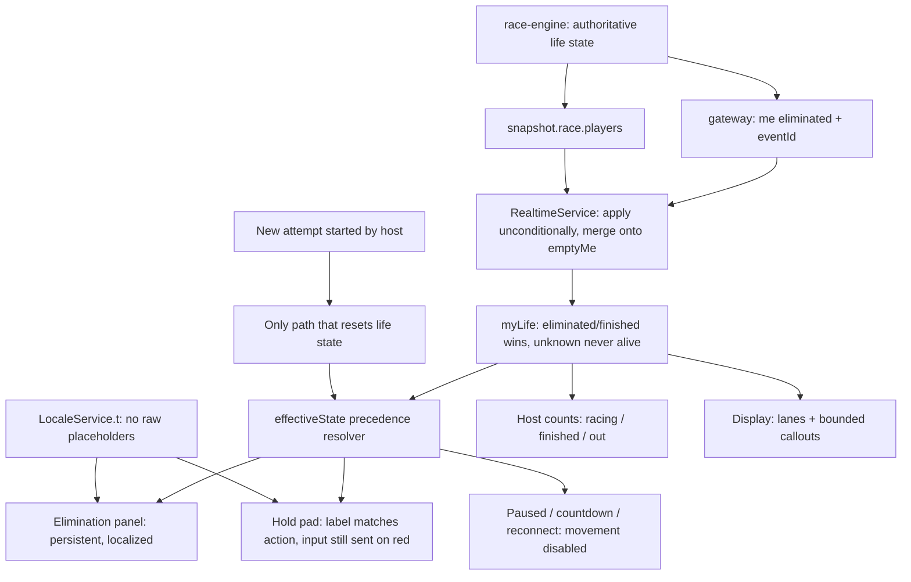

# Corrective Contract: Unmistakable Elimination, State, and Identity

## Overview
This plan supersedes the earlier UX redesign plan wherever the two conflict (Section 9 revision, 15 Sep 2026). The previous pass shipped the bilingual layer, host shell, display recomposition and shared components — all present in the workspace (`i18n/locale.service.ts`, `host/*`, `display/*`, `shared/*`). It did **not** resolve the reported failure: a participant was eliminated without realising it.

Read-only investigation confirmed four concrete defects, not merely presentation gaps. Each was verified by reading the source.

**P0 — elimination can be silently dropped (confirmed client defect).** `apps/web/src/app/core/realtime.service.ts`, the `me` handler:

```ts
const cur = this.me();
if (cur?.race) this.me.set({ ...cur, race: { ...cur.race, state: 'eliminated' } });
return;
```

If `me()` is null or `me().race` is null, the authoritative elimination is **discarded** and the player keeps rendering as alive. `emptyMe()` returns `race: null`, so that is the default state after a refresh, a reconnect, or before the first personal race payload arrives — not an edge case. Note the non-eliminated branch below it correctly merges onto `emptyMe()`; only the eliminated branch has the bug. The server is correct: `events.gateway.ts:58` emits `me { eliminated: true, eventId }` to `p:<id>`, and `race-engine.ts` owns one-time life-state transitions. The break is purely client-side application of the event.

**P0 — elimination is not persistent or personal.** The only eliminated treatment is one line in `games/hold-button.component.ts`: a small `.alert.alert-error` reading `■ Eliminated — you moved on RED. Back next race.` It renders *below* the track, is hard-coded English, and has no avatar collapse, no "This race: 0 points", no "your previous points are safe", and no final-race variant. Nothing restores it from a snapshot after a refresh.

**P0 — the largest instruction invites the forbidden action.** The same component renders `RED — STOP` above a bright `--elm-blue` button labelled `HOLD TO MOVE`, with `Release now!` demoted to a 16 px `.hint`. Every string in that component is hard-coded English, so the phone's most important game surface is not localized at all despite the i18n layer existing.

**P0 — interpolation leaks placeholders.** `LocaleService.t()` returns the raw token when a param is missing:

```ts
return v === undefined || v === null ? whole : String(v);
```

Any caller passing an undefined count renders a literal `{total}`/`{answers}` — exactly the Arabic host screenshot. Combined with race stages reusing answer counters, the host sees a meaningless `Answers` readout during a race.

**P1 — unexplained `#`.** `play.component.ts:46` renders `<bdi>#{{ ident.number }} · …</bdi>` with no label, beside a separate rank badge, so a registration number reads as a rank.

Behaviour is repaired first, presentation second, per Section 9.9. Scoring in `packages/shared/src/scoring.ts` and `round-scoring.ts`, red tolerance, one-time death events, and host authority are preserved unchanged. All new code uses `const`/`let` on the approved NestJS + Angular stack [tech-stack].

## Design

### 1. Repair the elimination delivery path (P0, first)
- **`core/realtime.service.ts`** — apply the eliminated flag unconditionally: merge onto `emptyMe()` when `me()` is null and synthesise the `race` block when it is missing, so life state can never be lost. `seenElimination` continues to gate the one-shot animation/sound, never the state itself.
- **Persist across reconnect.** Derive `myLife` from `snapshot().race.players` matched on the participant id and merge with `MyRoundState.race.state` under an "eliminated/finished wins" rule. Unknown state never resolves to `alive` [secure-coding].
- **Never revive.** Life state resets only when the server starts a new host-authorized attempt. Release, animation end, refresh, locale change, pause/resume and reconnect all leave the outcome intact.
- Confirm `participation.service.ts` / `snapshot.ts` include personal life state on connect; extend them if the reconnect payload omits it.

### 2. Repair interpolation and irrelevant counters (P0)
- `LocaleService.t()` never emits a raw `{token}`: missing params resolve to an empty string (or a neutral dash for counts) plus a dev-only warning naming the key.
- Extend `scripts/i18n-audit.cjs` to flag placeholder-set mismatches between `strings.en.ts` and the Arabic parts, and templates passing fewer params than a key requires.
- Host counters become stage- and game-aware: racing/finished/eliminated during RLGL, saved/locked during GEO and ORDER. `Answers` is never rendered for a race.

### 3. Participant state machine: one primary panel (P0/P1)
Replace the overlapping banners in `play.component.ts` + `hold-button.component.ts` with a single `games/race-state-panel.component.ts` driven by one computed `effectiveState`, resolved in this precedence so a known outcome always dominates:

`eliminated | finished` > `reconnecting` > `paused` > `countdown` > `timeEnded` > `green/red (holding or not)` > `ready` > `instructions`

One localized panel per Section 9.3 row, largest text matching the current action:
- Green not holding → "Hold to move" / "اضغط باستمرار للمشي"; green holding → "You're moving…" with "Release when the light turns red" secondary.
- Red holding → dominant "Release now!" / "ارفع يدك الآن!"; red not holding → neutral resting pad labelled "Stop! Do not press" / "وقف! لا تضغط". **The pad never says "Hold to move" on red, yet input stays enabled and reported** so the elimination rule keeps working — visual change only, no softening.
- Countdown, ready, paused, reconnecting, time-ended-survived and finished disable movement and remove the pad entirely.

`hold-button.component.ts` keeps its hold lifecycle (250 ms heartbeat; release on pointer up/cancel/leave, `window:blur`, `visibilitychange`) and adds release on locale change, resize/orientation change, and overlay open, so no stuck hold or unintended move command survives those events.

### 4. The elimination moment (P0)
New `games/elimination-panel.component.ts`:
1. On confirmed elimination, movement stops immediately and the panel replaces the whole primary game panel — no waiting for a leaderboard, signal or round end.
2. Brief avatar collapse plus the agreed short sound where audio is enabled; `prefers-reduced-motion` gets an immediate state change; a muted device still gets the full outcome visually.
3. A stable high-contrast card persists for the rest of the race — not a toast.
4. Restored from the snapshot after a refresh **without** replaying the sound (`seenElimination` suppresses the effect, not the card).

Content, both languages: "You're out this race!" / "انتهت جولتك!" → "You moved while the light was red." → "This race: 0 points" → "Your previous points are safe. You return when the host starts the next race." On the final race of a game the last line becomes the game-complete wording; no promise of a race that does not exist. Optional compact spectator line from real state. No Restart, no Try again, no enabled pad.

Display: one brief readable callout with name and avatar; simultaneous deaths aggregate into a bounded summary ("12 players out") instead of queued blocking animations. Host: alive/finished/eliminated counts and roster status update immediately; the last survivor is described as "1 player remains — the race continues until they finish or time runs out", never "winner".

### 5. Identity: name, avatar, labelled player number (P1)
Join confirmation shows name + auto avatar + stable short number ("Abdullah · Player 07" / "عبدالله · لاعب 07"), identical on phone, host roster and display; duplicate names disambiguate by number. The bare `#` leaves the `play.component.ts` header in favour of separately labelled **Player number** and **Tournament rank**. The single-letter language control becomes a labelled `العربية / English` toggle. Standings gain a persistent `You` / `أنت` card above a searchable list with real rank, points and an explicit tied indicator — never discovered through pagination. Before reveal: "Rank appears when results are revealed", never a stale or invented rank.

### 6. Host: one live decision area (P1)
Every stage maps to main-panel text, a primary action and a useful secondary action per the Section 9.5 table, sourced from authoritative state. "No action available now" is replaced by live context explaining what is happening and how the round ends. Manual shows two large explicit RED/GREEN controls with the current signal visually distinct from the next selectable command; Auto hides or explicitly disables manual buttons with a stated reason. The audience preview carries labelled **Display language** and **Open display** controls, independent of the host's own language. End Session and void/replay stay outside ordinary live controls; a next-stage button must never quietly end a live race or award points early.

### 7. Shared race display: readable lanes (P1)
Recompose `display/race-arena.component.ts`: labelled seconds-remaining timer, dominant STOP/GO band, ~6–8 large lanes at 1080p (avatar, short name/number, progress, finish marker), a labelled Racing/Finished/Eliminated strip, and a small bounded event feed. Lane selection uses one declared rule (furthest progress first) with "Showing 8 of 40 active racers" when truncated, updated deliberately to stay readable; **lane selection is cosmetic and never changes ranking or state**. One remaining racer gets a large focused lane; the field of eliminated dots becomes a quiet aggregate. The phone remains the authoritative personal view.

### 8. Results and the other two games (P1)
Immediate personal outcome is separated from the host-controlled score reveal: elimination/finish shows at once (including the eliminated race's known 0) without exposing anyone else's unrevealed scores. After reveal: outcome, this round's raw score, this game's points out of 1,000, tournament total out of 3,000 with published or shared rank, and what comes next. No implication that a raw race score adds directly to 3,000; any +points animation is computed from actual published game totals. A zero race adds nothing and deletes nothing. Final standings always include a personal card plus search and "Show me". Map and ordering get explicit `No pin → saved → locked/accepted at timeout → waiting → explained` transitions; a saved message is never a correctness hint; timeouts are explained rather than shown as a bare zero.

### 9. Readability targets (release criteria)
Participant body 16–18 px, instruction 28–36 px, outcome 32–40 px; host operational 16 px, active state 24–32 px; display names/status 28–36 px, signal 64–96 px, timer 64–80 px. Reduce visible lanes/rows before shrinking essential names. Navy on light surfaces carries essential information — never pale labels or tiny marks alone. Verified at 1366x768 host, 360x640 phone and 1920x1080 display, with zoom and larger text. ASAS attribution stays secondary to the player's state.



## Changes
- `apps/web/src/app/core/realtime.service.ts` — apply `eliminated` unconditionally, merge onto `emptyMe()`, synthesise a missing `race`, keep `seenElimination` for the effect only, derive personal life from the snapshot.
- `apps/web/src/app/i18n/locale.service.ts` — placeholder-safe `t()` with a dev warning.
- `apps/web/src/app/i18n/strings.en.ts`, `strings.ar.ts`, `strings.ar.part1-3.ts` — race state, elimination, identity, host stage and display strings with matched placeholder sets.
- **New:** `apps/web/src/app/games/race-state-panel.component.ts`, `apps/web/src/app/games/elimination-panel.component.ts`.
- `apps/web/src/app/games/hold-button.component.ts` — localized, label matches action, red keeps sending input, release on locale/resize/overlay.
- `apps/web/src/app/participant/play.component.ts` — single effective-state panel, labelled player number vs rank, labelled language control, `You` standings summary.
- `apps/web/src/app/participant/join.component.ts` — identity confirmation with name, avatar and player number.
- `apps/web/src/app/host/host.component.ts`, `status-bar.component.ts`, `primary-action.component.ts`, `signal-panel.component.ts`, `roster-list.component.ts`, `audience-preview.component.ts` — stage→action mapping, live context instead of "no action", race counters, display-language control.
- `apps/web/src/app/display/race-arena.component.ts`, `display.component.ts`, `leader-summary.component.ts` — lanes, labelled counts, bounded callouts, one-survivor focus.
- `apps/web/src/app/shared/result-breakdown.component.ts`, `standings-table.component.ts`, `waiting-card.component.ts`, `paused-panel.component.ts` — outcome-first hierarchy, ties, search, personal card.
- `apps/web/src/app/games/globe.component.ts`, `order-cards.component.ts` — explicit saved/locked/accepted transitions.
- `apps/api/src/rounds/participation.service.ts`, `snapshot.ts` — guarantee personal life state on connect/reconnect; solutions stay stripped before reveal [secure-coding].
- `apps/web/src/styles.css` — role-scoped type scale, contrast fixes, lane/pad sizing.
- `apps/web/scripts/i18n-audit.cjs` — placeholder-parity check.
- `docs/acceptance-evidence.md` — observed scenarios, measured latency, untested limitations.

## To-dos
- [x] Reproduce a real elimination and trace event → snapshot → render, recording observed end-to-end latency.
- [x] Fix `RealtimeService` so an eliminated `me` event applies even when `me()` or `me().race` is null.
- [x] Derive personal life state from the snapshot on reconnect; unknown state must never resolve to `alive`.
- [x] Reset life state only on a new host-authorized attempt; prove release/refresh/locale/reconnect never revive.
- [x] Make `t()` placeholder-safe and add placeholder-parity auditing for both dictionaries.
- [x] Remove answer counters from race stages; show racing/finished/eliminated instead.
- [x] Build the single race state panel with the Section 9.3 precedence and per-state copy in both languages.
- [x] Make the pad label match the action on red while still sending input for the elimination rule.
- [x] Build the persistent elimination panel with collapse effect, reduced-motion path and snapshot restore without replaying sound.
- [x] Add the final-race elimination wording variant.
- [x] Release the hold on locale change, resize/orientation change and overlay open.
- [x] Show labelled player number and tournament rank separately; remove the unexplained `#`.
- [x] Add the labelled `العربية / English` control and the identity confirmation on join.
- [x] Add the persistent `You` standings card with search, real ties and pre-reveal wording.
- [x] Implement the host stage → main text / primary / secondary action mapping with live context.
- [x] Make Manual show distinct current vs selectable signal; Auto hides or explains disabled controls.
- [x] Recompose the display arena into readable lanes with declared selection, labelled counts, bounded feed and one-survivor focus.
- [x] Implement immediate-outcome vs revealed-score separation and the full results hierarchy.
- [x] Add explicit map and ordering state transitions and explained timeouts.
- [x] Apply the role-scoped type scale and contrast; verify 360x640, 1366x768, 1920x1080, zoom and larger text.
- [x] Verify all required Section 9.9 scenarios, including tap-on-established-red and valid-release-within-tolerance.
- [x] Verify a fresh participant join URL separately from an authenticated host; confirm host-only authorization.
- [ ] Run the complete phone/host/display journey in Arabic and English; capture running-app screenshots of elimination, live red, host live controls, one-survivor display and personal results.
- [ ] Confirm no duplicate scoring, leaked answers, fabricated progress or accidental revival.
- [ ] Run the 3–5 person usability rehearsal and a first-time host run; record real results or label validation pending.

## Notes / Risks
- The dropped-elimination bug is a genuine client state defect, so CSS alone cannot fix it — but the server engine and gateway look correct, so no backend rewrite is warranted. Diagnose before touching `race-engine.ts`.
- Changing the red-phase pad label must not disable red input; removing it would delete the core elimination mechanic. Only genuinely inactive states (countdown, pause, death, finish, reconnect) disable movement.
- The "host screen under a join URL" and "63 eliminated" observations remain **Investigate**, not confirmed defects; the screenshots cannot establish either. Reproduce with a fresh session and real input before changing rules or timing.
- Screenshots captured at different remaining times are not evidence of desynchronization; check synchronized live clients first.
- Many simulated names in the display screenshot suggest rehearsal bots (`simulation.service.ts`); confirm whether the observed run was a rehearsal before treating the counts as real.
- `colors.pdf` and official Elm fonts/logo are absent from the workspace; the palette comes from the verified values already in `styles.css` and a system Arabic/Latin stack will be used. No fallback will be presented as official.
- Arabic copy needs a native Saudi-workplace review pass; the terminology table is a seed, not a dictionary.
- Two pre-existing `apps/web/tsconfig.json` diagnostics (`rootDir`, deprecated `baseUrl`) are unrelated to this work but will surface in builds.
- Any device, viewport or network condition that cannot be exercised locally will be reported as untested rather than assumed working.
