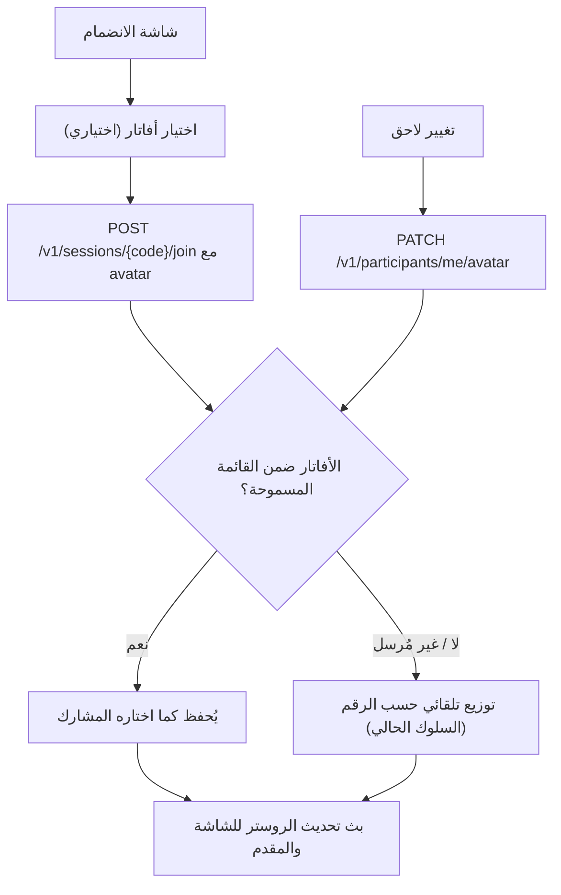

# تحسين منصة التتويج، حساب الخريطة على السرعة، واختيار الشخصية عند الدخول

## Overview
ثلاثة تعديلات مطلوبة:
1. **منصة المراكز الثلاثة على شاشة العرض** صغيرة والنص يطلع خارج الصندوق/الشاشة — نحسّن التصميم والمقاسات ومنع تجاوز النص في `apps/web/src/app/shared/podium.component.ts` (وضع `large`).
2. **لعبة الخريطة (Pin the Country)**: الآن يجب وضع الدبوس قرب مركز الدولة للحصول على 100. المطلوب: **يكفي أن يكون الدبوس داخل الدولة**، والتفاضل بين اللاعبين يكون **بسرعة التثبيت** (الأسرع يأخذ أكثر).
3. **اختيار الشخصية (الأفاتار)**: حاليًا يوزّعها الخادم تلقائيًا حسب رقم الانضمام. المطلوب أن يختارها المشارك بنفسه عند الدخول ويستطيع تغييرها.

## Design

### 1) منصة العرض (podium `large`)
المشكلة الحالية في `podium.component.ts`: مقاسات ثابتة بالبكسل، `max-width: 12ch/14ch` مع `white-space: nowrap` يقصّ الأسماء، والأعمدة لا تتمدد لملء الشاشة الكبيرة. الحل:
- الوضع `large`: أحجام خط بـ `clamp()` مبنية على `vw/vh` لكل العناصر (الرقم، التسمية، الأفاتار، الاسم، النقاط) بدل البكسل الثابت.
- الأسماء: `min-width: 0` على العناصر المرنة + التفاف على سطرين (`overflow-wrap: anywhere; display:-webkit-box; -webkit-line-clamp:2`) بدل القص بسطر واحد، مع الإبقاء على `<bdi>` لسلامة العربية RTL.
- الأعمدة تتمدد: `width: min(30vw, 420px)` وارتفاعات بـ `min-height: XXvh` بدل بكسلات، مع حد أقصى يمنع الخروج من تركيبة الشاشة الثابتة (`overflow: hidden` في display).
- إبقاء ألوان Peach / Light Blue / Lavender والترتيب (الثاني–الأول–الثالث) كما هو، والهاتف (الوضع الصغير) بدون تغيير سلوكي.

### 2) حساب الخريطة على السرعة
الوضع الحالي في `packages/shared/src/scoring.ts`:
- `geoRoundScoreV2`: داخل الدولة → `80 + speedBonus` (السرعة فقط عند قفل يدوي)، خارجها → `80 − d/50`.
- المشكلة المذكورة («لازم وسط الدولة عشان 100») تطابق سلوك **v1** المبني على المسافة؛ يجب التأكد أن `defaultFrozenContent()` يجمّد نسخة v2، والجلسات الجديدة ستستخدمها.

التعديل المقترح (يبقى الحساب كله على الخادم — لا يُقبل أي score من العميل [secure-coding]):
- **داخل الدولة**: النقاط = `BASE (60) + SPEED (40)` — نرفع وزن السرعة من 20 إلى 40 ليصبح الأسرع هو الفارق الحقيقي، وأول من يثبّت داخل الدولة يقترب من 100.
- `speedBonus` يبقى خطيًا على نافذة الجولة وبتقريب 100ms، لكن يُمنح **لأي قفل داخل الدولة** (يدوي أو عند انتهاء الوقت بدبوس موضوع؟ — لا: يبقى مشروطًا بالقفل اليدوي كما هو، لأن غير المُقفِل لم «يسرع» أصلًا؛ من لم يقفل يدويًا وداخل الدولة يأخذ الأساس 60 فقط).
- **خارج الدولة**: يبقى تدرّج المسافة كتعادل رحيم لكنه لا يتجاوز الأساس: `max(0, 60 − d/50)` بلا مكافأة سرعة — أي أن أي شخص داخل الدولة يتفوق دائمًا على أي شخص خارجها.
- تحديث `GEO_ZERO_DISTANCE_KM_V2` والثوابت المشتقة، ونصوص الشرح في i18n (`howto.GEO.scoring` ونحوها) بالعربية والإنجليزية.
- تحديث `packages/shared/test/scoring.test.ts` واختبارات `round-scoring`.

### 3) اختيار الشخصية عند الدخول
- **الخادم** (`apps/api/src/sessions/`):
  - تصدير قائمة `AVATARS` إلى `packages/shared` لتكون مصدر الحقيقة الواحد للعميل والخادم.
  - `POST /v1/sessions/{code}/join` يقبل حقل `avatar` اختياريًا؛ يُتحقق أنه ضمن القائمة المسموحة (إدخال مرفوض = يسقط للتوزيع التلقائي الحالي) [secure-coding][api-conventions].
  - نقطة جديدة `PATCH /v1/participants/me/avatar` (بتوكن المشارك) لتغيير الأفاتار بعد الدخول، مع بثّ تحديث الروستر عبر الـ gateway حتى تتحدث الشاشة والمقدّم فورًا.
- **الواجهة** (`apps/web/src/app/participant/join.component.ts`):
  - شبكة اختيار أفاتار (16 إيموجي) في شاشة الانضمام قبل زر «ادخل»، مع خيار «عشوائي» افتراضيًا.
  - حفظ الاختيار في الهوية المخزّنة (`saveIdentity`) وعرضه في شاشة التأكيد الحالية.
  - زر صغير في شاشة الانتظار/اللعب لتغيير الشخصية (يستدعي الـ PATCH).
- لا يغيّر الاختيار الهوية أو الرقم أو رمز الاسترجاع — الأفاتار خاصية عرض فقط.

## Changes
- `apps/web/src/app/shared/podium.component.ts` — إعادة ضبط أنماط الوضع `large`: مقاسات نسبية (`vh/vw/clamp`)، التفاف الأسماء بدل قصّها، تمدد الأعمدة، بلا خروج نص عن الصندوق.
- `packages/shared/src/scoring.ts` — `geoRoundScoreV2`: داخل الدولة = 60 أساس + 40 سرعة؛ خارجها = تدرّج مسافة بسقف 60 بلا سرعة؛ تحديث الثوابت.
- `packages/shared/test/scoring.test.ts` — تحديث توقعات الخريطة (داخل أسرع > داخل أبطأ > خارج دائمًا).
- `packages/shared/src/index.ts` + ملف جديد أو `content.ts` — تصدير `AVATARS` المشتركة.
- `apps/api/src/sessions/sessions.service.ts` — `join(..., avatar?)` مع تحقق من القائمة؛ دالة `setAvatar(participantId, avatar)`.
- `apps/api/src/sessions/sessions.controller.ts` + `dto.ts` — حقل `avatar` في join DTO + مسار `PATCH /v1/participants/me/avatar` [api-conventions].
- `apps/api/src/realtime/events.gateway.ts` — بث تحديث الروستر بعد تغيير الأفاتار.
- `apps/web/src/app/participant/join.component.ts` — شبكة اختيار الأفاتار + تمريره في `api.join` + زر تغيير.
- `apps/web/src/app/core/api.service.ts` — تمرير `avatar` في join + دالة `changeAvatar`.
- `apps/web/src/app/i18n/strings.en.ts` / `strings.ar.*.ts` — مفاتيح جديدة (اختر شخصيتك، عشوائي، غيّر الشخصية) + تحديث شرح حساب الخريطة.

## To-dos
- [x] إصلاح أنماط `podium.component.ts` للوضع `large`: مقاسات نسبية والتفاف الأسماء ومنع أي تجاوز للنص
- [x] التحقق بصريًا أن وضع الهاتف (الصغير) للمنصة لم يتأثر
- [x] تعديل `geoRoundScoreV2`: داخل الدولة = أساس + سرعة (60/40)، خارجها بسقف الأساس بلا سرعة
- [x] التأكد أن `defaultFrozenContent()` يجمّد نسخة القواعد v2 للجلسات الجديدة
- [x] تحديث اختبارات الحساب (`scoring.test.ts`, `rounds-service.test.ts`) ونجاحها كلها
- [x] تحديث نصوص شرح حساب الخريطة في i18n (عربي + إنجليزي)
- [x] نقل `AVATARS` إلى `packages/shared` وتصديرها
- [x] دعم `avatar` اختياري في join API مع تحقق من القائمة المسموحة
- [x] إضافة `PATCH /v1/participants/me/avatar` + بث تحديث الروستر
- [x] شبكة اختيار الأفاتار في شاشة الانضمام + زر تغيير لاحق + مفاتيح i18n
- [x] تشغيل `npm test` كاملًا والتأكد من نجاح كل الاختبارات

## Notes / Risks
- **الجلسات الجارية لن تتأثر** بتغيير حساب الخريطة: المحتوى ونسخة القواعد يُجمّدان عند إنشاء الجلسة — التغيير يسري على الجلسات الجديدة فقط.
- تغيير وزن السرعة (60/40) يغيّر توازن النقاط بين الألعاب الثلاث؛ لعبة الترتيب والسباق تبقيان على 80/20 — لو أردت توحيدها أخبرني قبل التنفيذ.
- الأفاتار المُختار يجب التحقق منه على الخادم دائمًا (قائمة بيضاء) حتى لا يُحقن نص/إيموجي عشوائي في الشاشة العامة [secure-coding].
- لا يوجد قفل تفرّد للأفاتار — أكثر من مشارك قد يختار نفس الشخصية (نفس السلوك الحالي عند تجاوز 16 مشاركًا)؛ التمييز يبقى بالاسم والرقم.
